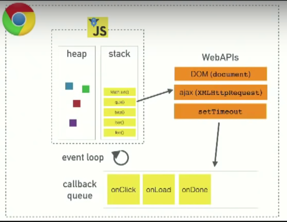

# Asynchronous Design Patterns

- Callbacks
- Promises
- Async Await
- Generators


### Synchronous code
- A bunch of statements in **sequence**
- Each statement in a synchronous code is executed one after the other
- Each statement has to wait for the previous one to finish executing

```js
  console.log('Our first sync statement.');
  console.log('Our second sync statement.');
  console.log('Our third sync statement.');
  console.log('Our fourth sync statement.');
  console.log('Our fifth sync statement.');
```
The statements above will execute in **order**, outputting: 

```bash
Our first sync statement.
Our second sync statement.
Our third sync statement.
Our fourth sync statement.
Our fifth sync statement. 
```

That’s because it’s written **synchronously**.

### Asynchronous code
Asynchronous code takes statements outside of the main program flow, allowing the code after it to be executed immediately without waiting. What if our code contains a code that cant be executed immediately. For example an API request, where we have to send a request and wait for a response? to stimulate this action, we are going to use `setTimeout`. 

**for example:**
```js
console.log('Our 1st sync statement.');
console.log('Our 2nd sync statement.');
console.log('Our 3rd sync statement.');
console.log('Our 4th sync statement.');
console.log('Our 5th sync statement.');

setTimeout(function () {console.log('Our 6th sync statement.')}, 3000);

console.log('Our 7th sync statement.');
console.log('Our 8th sync statement.');
console.log('Our 9th sync statement.');
```

### Async Examples
- setTimeout() : Execute a specified block of code once after a specified time has elapsed.

- setInterval() : Execute a specified block of code repeatedly with a fixed time delay between each call.

- requestAnimationFrame() : The modern version of setInterval(). Executes a specified block of code before the browser next repaints the display, allowing an animation to be run at a suitable framerate regardless of the environment it is being run in.


- addEventListener()

- fetch()

### Set timeout

`setTimeout` allows us to run a function asyncronously after an interval of time. It is not a part of javascript sprecification. But most environments like browsers & node.js support it.

### call stack,  event loop, callback queue 



credit: [Philip Roberts](https://www.youtube.com/watch?v=8aGhZQkoFbQ)

**the call stack**

The **callstack** is basically a datastructure that records where in the program we are. So if we execute a function, we put something on the stack & if we return from a function, we pop off something from the top of the stack. This is applicable for all our **syncronous** code.

The **taskqueue** keeps a queue of all the ready to execute asynchronous callbacks.

The **eventloop**'s job is to look at the **callstack** and look at the **taskqueue**. if the stack is empty, it takes the *first* thing on the **taskqueue** and pushed it on to the **callstack**, which effectively runs it.

We se a lot of `setTimeout(fn, 0);`. The purpose of it is to basically defer the execution of the callback function until the **callstack** clears. 

The **renderqueue** is almost like a **taskqueue**. The browser would like to repaint the screen, for example, every 16.6ms (60 frames/second). But its constrained by what you're doing in javascript. So, it can't actually do a render if there's a call in the **callstack**. The **renderqueue** has to wait till the callstack is clear. The difference is that the render is given a higher priority than your callback. Every 16.6ms it's going to queue a render, wait till the stack is clear, before it can actually do that render.  

The purpose of the event loop is to make sure that all the code is handled. JavaScript has a single threaded environment, we can only execute one piece of code at a time. But the event loop makes it possible to achieve asynchronicity because we're able to set code aside such as a callback that was created by (web or c++ api) set timeout, set that aside and then the event loop will check for that and make sure that it gets taken care of when it's time to execute that. 

### Callbacks
Traditionally the callbacks were the only way of acheiving asyncronicity in javascipt. The modern patterns like Promises / Async await relies on callbacks, so its important to understand them.

A Callback is simply a function that is invoked after something else happens and it is acheived by passing a function to another function as an argument in Javascript. The function that we pass to an other function, is called back after something else happens. 
