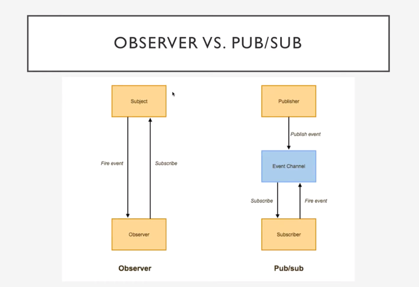
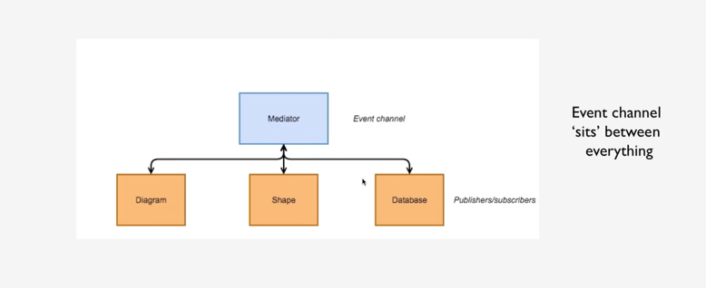

# Mediator Pattern

**Mediator** is a behavorial design pattern that lets you reduce chaotic dependencies between objects. The pattern restricts direct communications between the objects and forces them to collaborate only via a mediator object.

It allows a **mediator** (a central authority) to act as the coordinator between different objects, instead of objects referring directly to each other. 

## Problem
When you have multiple objects that are communicating directly with each other, you're essentially working around a many-to-many relationship which may become a nightmare when debugging.

## Solution
Introducing a mediator object will help reduce this issue by introducing a one to many flow between objects. Other notable benifits include reducing dependencies between objects, much lighter errors, increased code maintainability and readability.

## Real-world Analogy

Pilots of aircraft that apprach or depart the airport dont communicate directly with each other. Instead they speak to an air traffic controller, who sits in a tall tower somewhere near the airstrip. The tower doesn't need to control the whole flight. It exists only to enforce constraints in the terminal area because the number of involved actors there might be overwhelming to a pilot.

## When to use
- If your system has multiple parts that need to communicate
- To avoid tight coupling of objects in a system with a lot objects
- To improve code readablity
- To make code easier to maintain
- If communication between objects becomes complex and hinders the reusability of code.

## Simple example
```
// Colleagues
const User = function (name) {
  this.name = name;
  this.chatroom = null;
};

User.prototype = {
  send: function (message, to) {
    this.chatroom.send(message, this, to);
  },
  receive: function (message, from) {
    console.log(`${from.name} to ${this.name}: ${message}`);
  }
}
```

```
// Mediator
const Chatroom = function () {
  let users = {};

  return {
    register: function (user) {
      users[user.name] = user;
      user.chatroom = this;
    },
    send: function  (message, from, to){
      if (to) {
        to.receive(message, from);
      } else {
        for (let key in users) {
          if (users[key] !== from) {
            users[key].receive(message, from);
          } 
        }
      }
    }
  }
}
```

```
// Usage
const john = new User('John');
const adam = new User('Adam');
const nita = new User('Nita');

const chatroom = new Chatroom();

chatroom.register(john);
chatroom.register(adam);
chatroom.register(nita);

john.send('Hello Nita', adam);
adam.send('Hello Nita!', nita);
nita.send('Hello Everyone!!');
```

Result:

```bash
John to Adam: Hello Nita
Adam to Nita: Hello Nita!
Nita to John: Hello Everyone!!
Nita to Adam: Hello Everyone!!
```


## Objects participating in the mediator pattern
- **Mediator** - In the sample code `Chatroom`
  - defines interface for communicating with `Colleague` objects
  - maintains references to `colleagues` objects
  - manages central control over operations
- **Colleagues** - In the same code `User`
  - objects are being mediated by the Mediator
  - each instance maintains a reference to the Mediator
 
Another nice example of a mediator is a wizard type of interface. Let's say you have a large registration process for a system you have worked on. Oftentimes, when a lot of information is required from a user, it is a good practice to break this down into multiple steps.

This way, the code will be a lot cleaner and the user isn't overwhelmed by the amount of information which is requested just in order to finish the registration. A mediator is an object which would handle the registration steps, taking into account different possible workflows that might happen due to the fact that each user could potentially have a unique registration process. 

In implementation terms, **Mediator pattern** is essentially a **shared subject** in the **Observer pattern**. This might assume that a direct (Pub/Sub) relationship between objects in such system is scrificed in order to maintain a central point of contact.

It may also be considered supplemantal - perhaps used for application-level notifications such as a  communication between different subsystems that are themselves complex and may desire internal component decoupling through PubSub relationships.

Another analogy would be DOM event bubbling and event delegation. If all subscriptions in a system are made against the document rather than individual nodes, the document effectively serves as a mediator. Instead of binding to the events of the individual nodes, a higher level object is given the responsibility of notifying subscribers about interaction events. 

## PubSub (Event Aggregator) And Mediator together

In a menu, clicking a menu item may trigger a series of changes throughout the application. Some of these changes will be independent of others, and using an **event aggregator** for this makes sense. But some of these changes may be internally related to each other, and may use a **mediator** to enact those changes.

A **mediator**, then could be set up to listen to the **event aggregator**. It could run its logic and process to facilitate and coordinate many objects that are **related** to each other, but **unrelated** to the original event source.

## PubSub vs Mediator

**PubSub:**



- EventChannel as pub/sub itself sits between publisher and subscriber and encapsulates all connection details.
- Support of different events and handlers inside one object.
- Many-to-Many connection

**Mediator:**




Event channel sits between everthing. Everything communicates with the mediator and the mediator coordinates the communication between all compoenents. In implementation terms, **Mediator pattern** is essentially a **shared subject** in the **Observer pattern**.

Pub/Sub | Mediator
-- | --
Scope of usage: Event-based dependency whithout usage of specific component instance | Event-based dependency of components on the level of application 
Profit: No specifics of connection stored in compoenents itself, many events to subscribe on | All Pub/Sub advantages + a mediator handling complex relationship between components.
